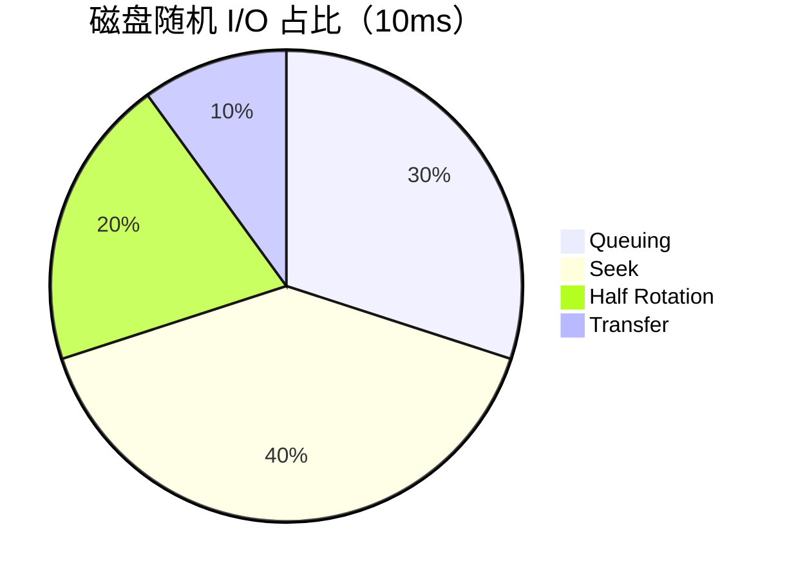

# 为什么mysql要用索引


<!--more-->

## 引入问题

有相当一部分时间，我对于<mark>mysql</mark>的索引理解是错误的。什么最左匹配原则，什么覆盖索引，什么聚集索引等概念似懂非懂。直到某天的一个上线需求让我认识到索引的重要性。
原有表:

````sql
CREATE TABLE `extend_new_user_profile` (
  `id` bigint(64) NOT NULL AUTO_INCREMENT COMMENT '主键ID',
  `user_id` varchar(36) NOT NULL COMMENT '用户ID',
  `md5_mobile_number` varchar(32) NOT NULL COMMENT '手机号码md5加密',
  `create_time` datetime DEFAULT CURRENT_TIMESTAMP COMMENT '创建时间',
  `update_time` datetime DEFAULT CURRENT_TIMESTAMP COMMENT '更新时间',
  PRIMARY KEY (`id`),
  UNIQUE KEY `unqi_user_id_name_id_card` (`user_id`),
  KEY `idx_md5_mobile_number` (`md5_mobile_number`),
) ENGINE=InnoDB AUTO_INCREMENT=326199 DEFAULT CHARSET=utf8mb4 COMMENT='';
````

当时的上线sql:

```sql
alter table
  extend_new_user_profile
add
  `is_authenticate` tinyint(4) NOT NULL DEFAULT 0 COMMENT '是否认证:0否,1是',
add
  `encrypt_id_card` varchar(128) NOT NULL DEFAULT '' COMMENT '身份id aes加密',
add
  `encrypt_real_name` varchar(128) NOT NULL  DEFAULT '' COMMENT '真实名字 aes加密';
```

```sql
ALTER table
  extend_new_user_profile
ADD
  unique index unqi_user_id_name_id_card(`user_id`,`encrypt_id_card`,`encrypt_real_name`);
```

其中业务代码上有个查询语句是这样的

```sql
select * from extend_new_user_profile where encrypt_real_name=? and encrypt_id_card= ?
```

ok 现在来看这句查询没有走到索引。线上效果表现的很明显，实名认证的接口直接超时，因为这个表大概有一亿多条数据。我心中有点疑惑，联合索引不应该每个字段都是命中因子吗？显然不是

## mysql 读取速度

在了解索引之前，要明白是什么拖慢了整个接口的响应时长。

| Work                                                       |        Latency |
| :--------------------------------------------------------- | -------------: |
| L1 cache reference //一级缓存                              |         0.5 ns |
| Branch mispredict //分支预测错误                           |           5 ns |
| L2 cache reference //二级缓存                              |           7 ns |
| Mutex lock/unlock //互斥锁                                 |          25 ns |
| Main memory reference //主存                               |         100 ns |
| Compress 1K bytes with Zippy //Zippy压缩1kB                |       3,000 ns |
| Send 1K bytes over 1 Gbps network //                       |      10,000 ns |
| Read 4K randomly from SSD* //随机从ssd读4kb数据            |     150,000 ns |
| Read 1 MB sequentially from memory //从主存顺读1MB数据     |     250,000 ns |
| Round trip within same datacenter //同一个数据中心往返     |     500,000 ns |
| Read 1 MB sequentially from SSD*//从ssd顺序读1MB数据       |   1,000,000 ns |
| Disk seek //机械硬盘寻道                                   |  10,000,000 ns |
| Read 1 MB sequentially from disk //从机械硬盘顺序读1MB数据 |  20,000,000 ns |
| Send packet CA->Netherlands->CA //从美国加州到荷兰再到加州 | 150,000,000 ns |

表 1- 2012 年延迟数字对比[^1]

[^1]: https://gist.github.com/jboner/2841832

### 数据加载顺序

```msc
Title: mysql 加载数据顺序
查询请求->database buffer pool: 
查询请求->内存: 如果database buffer pool没有则
查询请求->磁盘: 如果内存没有则
```


### 磁盘IO

上述关系描述了mysql加载数据的顺序
mysql 对数据的读取不是一行一行的读取，而是以页的形式。一般的来说mysql一页大小16KB，而linux系统包括Mac为4KB，可通过`getconf PAGE_SIZE` 获取。也就说读取的快慢和行数没有关系，和页数有关。如果`database buffer pool` 和 内存都没有命中，那么就会触发随机IO




上述统计描述io的总时长和占比，10ms对于计算机来说是个很大的时间消耗，这是查询请求最糟糕的一种情况

### 磁盘顺序I/O

磁盘的顺序I/O 和随机I/O在速度上是天差地别，如果一个页面有4KB，那么1s的时间可以读取10000页，而平均读取一页的内容所耗费0.1s，这个速度甚至比内存还快


### 内存读取

如果mysql在database buffer pool没有找到对应的数据页，那么会去内存寻找数据页，此过程花费大约1ms

### database buffer pool 读取

毫无疑问，从database buffer pool 读取是几种方式最快的一种方式

### 总结

要想查询的快要尽量减少随机I/O的读取																	

## 索引

根据一个节点包含的列数不同，可分为宽索引(联合索引)和窄索引。列如下面这个是窄索引

````sql
unique index unqi_user_id(`user_id)
````


这个就是宽索引

```sql
unique index unqi_user_id_name_id_card(`user_id`,`encrypt_id_card`,`encrypt_real_name`)
```


如果宽索引设计的好的话，可以避免二次随机I/O，列如这个查询语句

````sql
select user_id,encrypt_id_card,encrypt_real_name from extend_new_user_profile where user_id=?
````

值得注意的是，一张表里面，有且只有一个聚集索引，一般来说这个字段就自增主键`id`。

对于窄索引来说，找到匹配的数据项后通过id再次找到剩余的数据项。

## 匹配因子

实际情况可能是窄索引带来的二次随机I/O不可避免，那么我们就应该考虑谁来做匹配因子最合适------最左原则。如下一张表

```sql
CREATE TABLE `game_user` (
  `id` bigint(64) NOT NULL AUTO_INCREMENT COMMENT '主键ID',
  `user_name` varchar(128) NOT NULL DEFAULT '' COMMENT '名字',
 	`age` int(4) NOT NULL DEFAULT 1 COMMENT '年龄',
  `gender` tinyint NOT NULL DEFAULT 0 COMMENT '性别',
  PRIMARY KEY (`id`)
) ENGINE=InnoDB AUTO_INCREMENT=1 DEFAULT CHARSET=utf8mb4 COMMENT='user';
```

有哪些字段适合做匹配因子。


显然gender就不是一个好的匹配因子，因为会选中一半的数据，而user_name 就很适合做匹配因子，它可以过滤掉99.9%的数据


另外同一个字段不同的值的过滤占比是不同的，往往是最差的输入换来的是最差的性能


## 如何设计一个完美索引

三星索引[^2]对于一个查询来说是一个完美的索引，`where id = 2` 主键索引对于这个查询语句来说就是一个特殊的三星索引。
三星的定义

1. 第一颗星，所有的等值谓词的列，例如 `where name= 'joker'`  `where age= 18` 这种列，作为索引开头的最开始的列（最左原则）
2. 如果有`order by` 的列，需要加入索引列中
3. 查询字段覆盖所有的索引字段，以此避免再从主键索引查询剩余字段导致随机I/O


[^2]: 三星索引的定义来自《数据库索引设计与优化》


